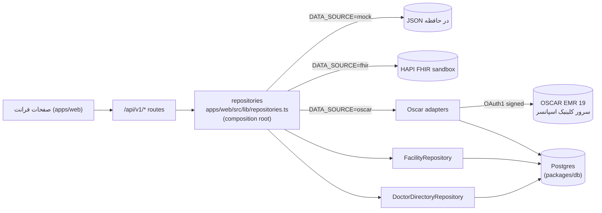
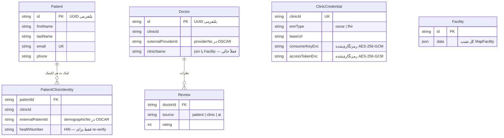
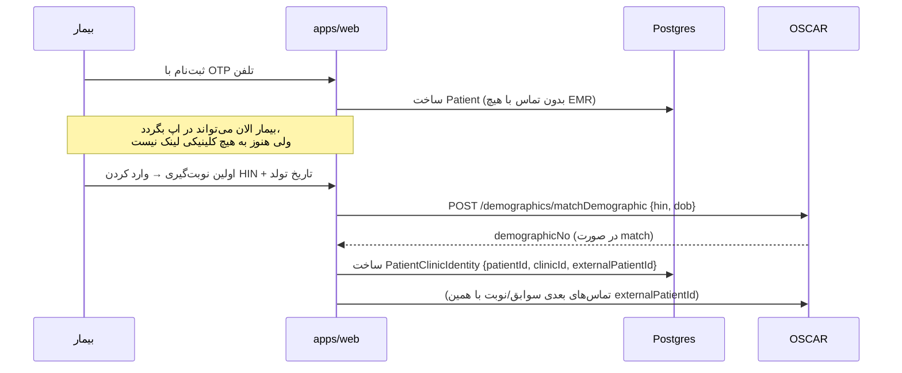

# معماری بک‌اند و دیتابیس — نمای کلی

سند مرجع کامل: [`docs/oscar/new-approach/docs-oscar-new-approach.md`](../oscar/new-approach/docs-oscar-new-approach.md).
این‌جا فقط نمای بصری/خلاصه است.

## ۱. لایه‌ها (Ports & Adapters)

هر صفحه از طریق یک route در `/api/v1/*` به یک **port** (اینترفیس) در
`packages/domain` می‌رسد، نه مستقیم به OSCAR/FHIR/دیتابیس. کدام **adapter**
پشتِ آن port واقعاً اجرا می‌شود را فقط یک env var (`DATA_SOURCE`) تعیین می‌کند —
بقیه‌ی کد اصلاً نمی‌داند داده از کجا می‌آید.

**نکته‌ی کلیدی:** Facilities و دایرکتوری پزشکان (پروفایل، نه availability)
همیشه از Postgres خودمان خوانده می‌شوند — مستقل از `DATA_SOURCE` — چون
پلتفرمی‌اند، نه داده‌ی یک کلینیک خاص.

## ۲. دیتابیس (Postgres — `packages/db`)

- **PHI (سوابق بالینی واقعی) هرگز این‌جا ذخیره نمی‌شود** — نسخه، آزمایش،
  آلرژی، نوبت، همیشه زنده از OSCAR/FHIR خوانده می‌شوند، هیچ‌وقت cache/persist
  نمی‌شوند. فقط لینک هویتی (`PatientClinicIdentity`) این‌جاست، نه خودِ داده.
- `User` (در `auth.prisma`) فعلاً مستقل و بی‌سیم است؛ session/OTP هنوز کاملاً
  **در حافظه‌ی پروسه** نگه‌داری می‌شود (`phone-auth-service.ts`)، نه در
  Postgres — یک شکاف شناخته‌شده، نه یک تصمیم نهایی.

## ۳. ثبت‌نام + لینک‌شدن به کلینیک (Registration flow)

بیمار در لحظه‌ی ثبت‌نام **هیچ تماسی با OSCAR نمی‌گیرد** — فقط یک `Patient`
پلتفرمی ساخته می‌شود. لینک‌شدن به کلینیک، تنبل (lazy) و فقط در اولین
نیاز واقعی (مثلاً اولین نوبت‌گیری) اتفاق می‌افتد:

## ۴. سه حالت `DATA_SOURCE`

| مقدار | داده از کجا | برای چی |
|---|---|---|
| `mock` | JSON هاردکد در `packages/domain` | توسعه‌ی فرانت بدون وابستگی به سرور |
| `fhir` | سندباکس HAPI FHIR محلی | تست/دموی قدیمی، هنوز کار می‌کند |
| `oscar` | سرور واقعی OSCAR EMR 19 (کلینیک اسپانسر) + Postgres خودمان | مسیر واقعی پروداکشن |

جزئیات endpoint‌به‌endpoint حالت `oscar` (کدام تأیید شده، کدام هنوز نه):
[`docs/oscar/OSCAR_ENDPOINTS_IN_USE.md`](../oscar/OSCAR_ENDPOINTS_IN_USE.md).
لیست کامل شکاف‌ها/تصمیم‌های معوق: [`deferred-items.md`](../oscar/new-approach/deferred-items.md).
